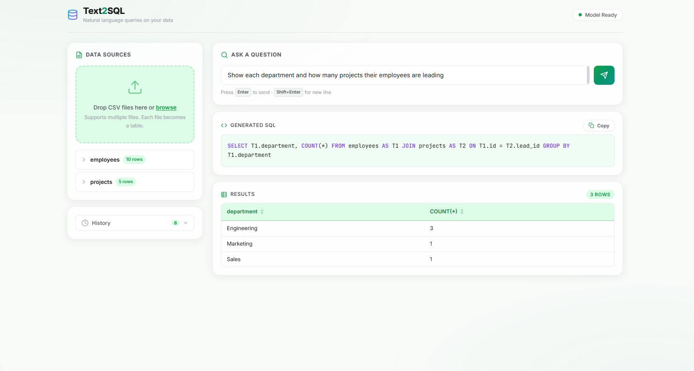
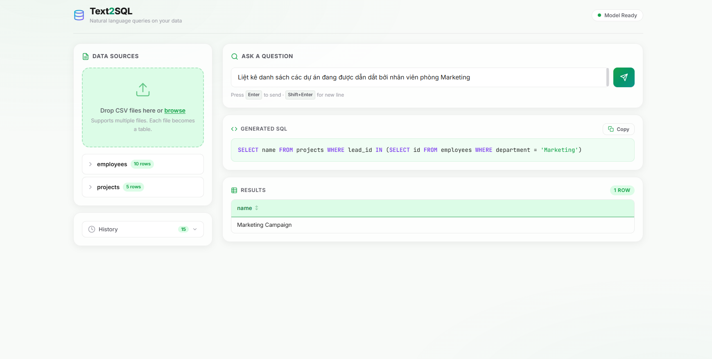

# Text2SQL Mastery: Optimized Gemma-2-2B Local LLM

A professional-grade natural language to SQL conversion system. This project leverages an optimized Gemma-2-2B Small Language Model (SLM) fine-tuned with precision techniques (QLoRA) to deliver high-accuracy, offline SQL generation for complex enterprise databases.

## Table of Contents

1. Technical Stack
2. Project Architecture
3. Installation and Setup
4. Training Dataset and Methodology
5. a/b testing (Model Evolution)
6. Evaluation and Benchmarking
7. UI Demonstration
8. Contact and Audit Report

---

## 1. Technical Stack

* **Frontend**: Next.js 16 (App Router), React 19, TypeScript, Tailwind CSS
* **Backend API**: FastAPI (Python 3.10+)
* **LLM Engine**: Ollama (Local Inference), Gemma-2-2B (Fine-tuned)
* **Inference Strategy**: Quantized GGUF (Q4_K_M) for high efficiency
* **Fine-tuning Framework**: Unsloth QLoRA
* **Infrastructure**: Docker, Docker Compose (NVIDIA GPU Support)
* **Database Engine**: SQLite3 (Internal Testing)

## 2. Project Architecture

The system is decoupled into a high-performance backend serving the local LLM and a modern web application for user interaction.

```text
├── api.py                    # FastAPI backend serving SQL generation
├── frontend/                 # Next.js web application
│   ├── app/                  # App Router logic
│   ├── components/           # Reusable UI components
│   └── lib/                  # Shared utilities and API clients
├── demo/                     # UI screenshots and video demonstrations
├── data_pipeline/            # Data engineering scripts
│   ├── prepare_spider.py     # Script for generating augmented training data
│   └── spider_augmented.jsonl# Specialized training dataset
├── evaluation/               # Performance measurement suite
│   ├── final_showdown.py     # Benchmark execution engine
│   ├── gold_standard_20.json # curated 20-question challenge set
│   └── FINAL_AUDIT_REPORT.md # Side-by-side performance analysis
├── notebooks/                # Fine-tuning documentation
│   ├── finetune_v1.ipynb     # Initial 12k dataset training (Accuracy Focus)
│   ├── finetune_v3.ipynb     # Spider-specialist training (Structure Focus)
└── docker-compose.yml        # Multi-service orchestration
```

## 3. Installation and Setup

### Prerequisites

* Node.js 20+ and npm
* Python 3.10+
* Docker with NVIDIA Container Toolkit
* Ollama (Local)

### Step 1: Clone and Environment

First, clone the repository and set up your local environment variables:

```bash
git clone https://github.com/adamwhite625/text2sql.git
cd text2sql

# Generate .env from example
cp .env.example .env
```

**Key Configuration Variables in .env:**

* `OPENAI_API_KEY`: Only required for GPT-4o benchmarking.
* `MODEL_NAME`: Your fine-tuned model name (e.g., `hf.co/adamwhite625/gemma-2-2b-text2sql-v3-spider-augmented`).

### Step 2: Backend Setup

Install Python dependencies and start the inference server:

```bash
# Install dependencies
pip install -r requirements.txt

# Start the FastAPI server
uvicorn api:app --host 0.0.0.0 --port 8000 --reload
```

### Step 3: Frontend Setup

Install Node dependencies and start the Next.js development server:

```bash
cd frontend
npm install
npm run dev
```

### Step 4: Infrastructure (Optional)

```bash
docker-compose up -d --build
```

## 4. Training Dataset and Methodology

The model training process utilized a dual-dataset strategy to balance broad language coverage with strict SQL structural requirements:

* **Broad Coverage (12k samples)**: Leveraged the `sql-create-context` dataset to teach the model basic mapping between natural language and SQL across diverse schemas.
* **Structural Specialization (Spider)**: Utilized the Spider dataset with schema-augmentation to enforce professional coding standards, multi-table JOINs, and standard aliasing.
* **Fine-tuning Technique**: Applied QLoRA via the Unsloth library to optimize the model on consumer-grade hardware while maintaining full-precision performance characteristics.

## 5. a/b testing

We conducted three distinct fine-tuning iterations to arrive at a production-ready state:

* **Version 1 (95.0% Accuracy)**: Achieved the highest raw performance but exhibited inconsistent table aliasing and minor hallucination in complex JOIN scenarios.
* **Version 2 (75.0% Accuracy)**: Tested a "context-heavy" approach. Results indicated that excessive prompt augmentation can deteriorate the model's fundamental SQL reasoning capabilities.
* **Version 3 (90.0% Accuracy)**: Final Specialist version. Prioritized structural reliability. While accuracy matches the base model on simple questions, its ability to handle cross-domain schemas with standard aliasing (T1, T2) is significantly superior.
    * **Model Repository**: [Hugging Face Model Hub](https://huggingface.co/adamwhite625/gemma-2-2b-text2sql-v3-spider-augmented)

## 6. Evaluation and Benchmarking

Performance is measured using a Gold Standard (20-question) suite, verified through Result-Match EX (Actual Query Execution).

| Model                        |  Accuracy (EX)  | Latency (Avg) |         SQL Style         | Key Highlights                       |
| :--------------------------- | :-------------: | :-----------: | :------------------------: | :----------------------------------- |
| **V1 (Large-Dataset)** | **95.0%** |    29.69s    |        Raw Pattern        | Highest overall accuracy             |
| **V3 (Spider-Spec)**   | **90.0%** |    32.27s    | **Standard Aliases** | **Production-ready structure** |
| **Gemma-Base** (2B)    |      90.0%      |    12.81s    |        Unstructured        | Strong baseline reasoning            |
| **GPT-4o-mini**        |     100.0%     |     2.07s     |          Perfect          | Enterprise Baseline (Cloud)          |

## 7. UI Demonstration

### Home Dashboard

Provides a clean interface for schema overview, CSV uploading, and real-time query interaction.



### Vietnamese Query Support

Demonstrates the model's cross-lingual capability, translating Vietnamese natural language into accurate SQL subqueries.


